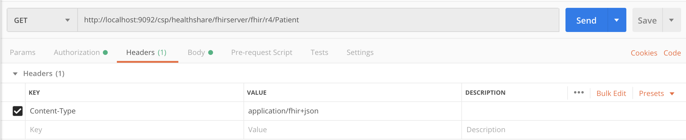

# Using a FHIR Server In Conjuction with InterSystems API Manager.

### Introduction

------

This demo comes pre-configured with a FHIR server, pre-populated with synthetic patient data.  The new InterSystems API Manager (IAM) includes OpenAPI Swagger specs to quickly generate REST client code to work with many common FHIR resources.   

### How to Run the Demo

------

The demo can be run locally with the following steps:

1. git clone https://github.com/sleblanc0916/covid-19-challenge.git
2. cd into the covid-19-challenge directory where docker-compose.yml is located
3. Run "docker-compose up --build"

Please note that the build can take 15-20 minutes, with most of the time spent loading synthetic patient data.  Make sure that you have at least 20GB of disk space.

After perfomring these actions your demo should be up and running on your machine. This includes an instance of InterSystems IRIS running an underlying FHIR server, and an Instance of the Intersystems API manager.

### What will you see

------

After running the above commands you will have multipe Docker containers running on your machine. The most important ones are:

- Intersystems IRIS for Health running on port 9088 
      - Management Portal: http://localhost:9088/csp/sys/UtilHome.csp
      - Username: _SYSTEM 
      - Password: sys
- InterSystems API Manager running on 8002, and 8003
      - API Manager Development Portal (FHIR Resource API Documentation): http://localhost:8003/default/documentation
      - API Manager Overview: http://localhost:8002

### Testing Your Demo

------

To take and make sure that your FHIR Server is up and running successfully you can test that you can successfully make requests to the exposed FHIR Endpoint. A tool like Postman can be very helpful here although it is not explicitly required. A simple curl request should work as well. I have provided an example request below (note the different port... the demo will run on 9088 by default)

